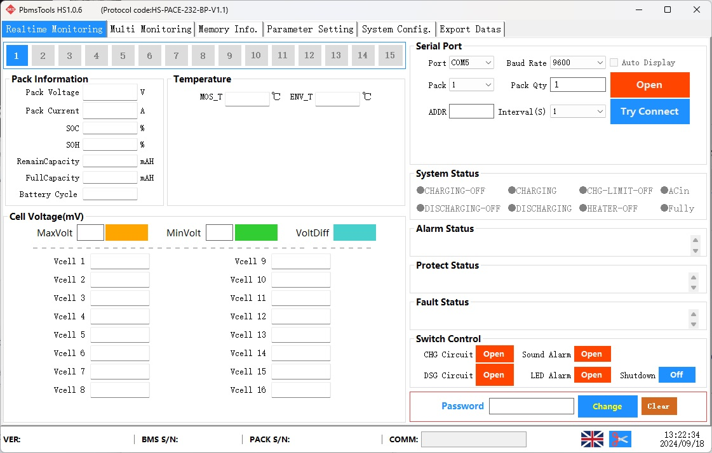
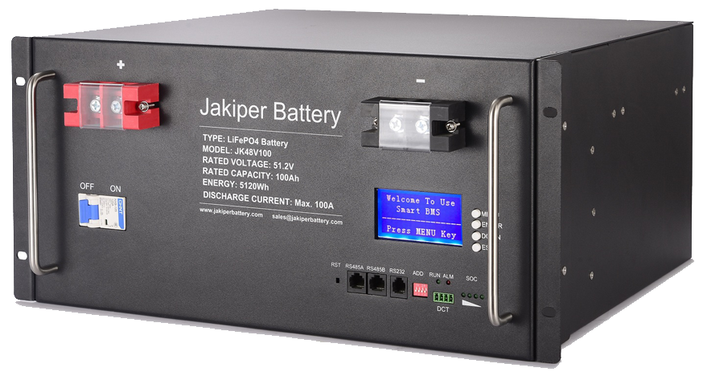

esphome-pace-bms
-
This is an **ESPHome** component that supports "**paceic**" protocol **version 20 and 25** which is used by seemingly the majority of low-cost rack-mount battery packs manufactured in SE Asia.  The BMS can be communicated with over **RS485** or **RS232** and is manufactured by PACE (or is a clone).

Example PACE BMS board:

The protocol is characterized by both requests and responses beginning with a '**~**' (tilde) character followed by two ASCII numbers either "**20**" or "**25**" and ending with a '**\r**' (carriage return) character.

I strongly encourage you to read through this entire document, but here are some Quick Links:
- [What batteries are supported?](fixme)
- [I just want an ESPHome config](fixme)
- [How do I wire my ESP to the RS485/RS232 port?](fixme)
- [I'm having a problem using this component](fixme)
- [I want to talk to a battery that isn't listed](fixme)

Paceic Protocol Version 20
-
  This protocol version is spoken by older battery packs and has several variants, with firmware customized by individual manufacturers.  Three protocol variants are currently known/supported:
 - **EG4**
 - **PYLON**
 - **SEPLOS**

Different manufacturers will have different BMS management software (it will not be PbmsTools) but typically it speaks a variant of paceic version 20.  These older BMSes will usually have two RS485 ports (looks like an ethernet socket) and may have an RS232 port (looks like a telephone socket).  They usually won't have a CAN bus port.

There is a high likelyhood that one of these protocol variants will work for battery packs speaking protocol version 20 which are branded by a different manufacturer than those listed, but if you can find a spec doc for a new variant that behaves differently, I can probably add support.  See [here](https://github.com/nkinnan/esphome-pace-bms/tree/main/protocol_documentation/paceic/0x20) for documentation on currently known version 20 protocol variants. 

Example protocol version 20 BMS front-panel:

Paceic Protocol Version 25
-
This version seems more standardized, with an official protocol specification from PACE itself.  As far as I know, all newer battery packs speaking this protocol version should be supported.  See [here](https://github.com/nkinnan/esphome-pace-bms/tree/main/protocol_documentation/paceic/0x25) for documentation on protocol version 25.

These BMSes speaking paceic version 25 will invariably use PbmsTools for their BMS management software (or a rebadged version of it) which looks like this:

The exact look isn't important, just the tabs and general layout will look like this.  This is PbmsTools regardless of any specific brand badging and indicates that your BMS supports protocol version 25.

These BMSes will typically have two RS485 ports (looks like an ethernet socket) an RS232 port (looks like a telephone socket) and possibly a CAN bus port and an LCD display as well, especially if newer.

Example protocol version 25 BMS front-panel:

Paceic MODBUS Protocol
-
Some BMS firmwares also support reading data via MODBUS protocol over the RS485 port.  I haven't looked into this yet.  It seems like it may co-exist with Paceic version 25.  Documentation can be found [here](https://github.com/nkinnan/esphome-pace-bms/tree/main/protocol_documentation/modbus)

Supported Values/Status (read only)
-
- All "Analog Information"
	- **Cell Count**
	- **Cell Voltage** (V) - up to x16 depending on your battery pack
	- **Temperature Count**
	- **Temperature** (°C) - up to x6 depending on your battery pack, typically this will be:
		-  *Cell Temperature* 1-4 
		- *MOSFET Temperature* 
		- *Environment Temperature*
	- **Total Voltage** (V)
	- **Current** (A) - positive or negative for charge/discharge
	- **Power** (W) - positive or negative for charge/discharge
	- **Remaining Capacity** (Ah)
	- **Full Capacity** (Ah)
	- **Design Capacity** (Ah)
	- **State of Charge** (%)
	- **State of Health** (%)
	- **Cycle Count**
	- **Minimum Cell Voltage** (V)
	- **Maximum Cell Voltage** (V)
	- **Average Cell Voltage** (V)
	- **Max Cell Differential** (V) - difference between minimum and maximum cell voltage
- All "Status Information" information decoded to human-readable text format
	- **Warning Text** - A list of any warnings reported by the BMS
	- **Protection Text** - If the BMS has protected itself or the batteries, for example disabling charging if the temperature is too low, or a cell voltage is too high, it will be listed here
	- **Fault Text** - A list of any faults reported by the BMS
	- **System Text** - Current system status such as "Charging"
	- **Configuration Text** - System configuration such as "Warning Buzzer Enabled"
	- **Balancing Text** - If any cells are currently balancing, they will be listed here
	- (individual status flag values) - These are what the text fields are decoded from, and are documented separately.  You probably won't need them, but they are available.  There are a lot of them and they vary by protocol version and variant.
(READ/WRITE)
- **Hardware Version** - The BMS hardware version (string)
- **Serial Number** - The BMS serial number (string)

Supported Configuration (read / write)
-
- **System Date and Time** - Allows access to the BMS internal real-time clock 
- **Shutdown** - A button which sends the shutdown command to the BMS

Supported Configuration (read / write) - Version 25 ONLY
-
It is difficult to find good consistent documentation on protocol version 20.  All the references I have are incomplete.  For version 25 I was able to sniff the exchanges between PbmsTools and my battery pack in order to decode all of the commands necessary for setting these configuration values.  However, the only battery pack I own  which speaks version 20 is sending some very strange non-paceic commands for most of the configuration settings.  Unfortunately I was unable to decode those, and even if I did, I'm not sure if it would apply to all brands of battery pack speaking version 20.  For that reason, I didn't pursue it further, and these settings are only applicable to battery packs speaking version 25.

- Toggles (switches) that turn various features on/off
	- **Buzzer Alarm**
	- **LED Alarm**
	- **Charge Current Limiter**
	- **Charge MOSFET**
	- **Discharge MOSFET**
- Selects (drop-lists) that allow configuring various features
	- **Charge Current Limiter Gear** - set to High or Low
	- **Protocol (CAN)** - Allows selection of various protocols spoken on the CAN bus, typically to match your inverter
	- **Protocol (RS485)** - Allows selection of various protocols spoken on the RS485 bus, typically to match your inverter
	- **Protocol Type** - Auto or Manual
- Configuration
  - Cell Over Voltage
	- **Cell Over Voltage Alarm** (V)
	- **Cell Over Voltage Protection** (V)
	- **Cell Over Voltage Protection Release** (V)
	- **Cell Over Voltage Delay** (seconds)
  - Pack Over Voltage
	- **Pack Over Voltage Alarm** (V)
	- **Pack Over Voltage Protection** (V)
	- **Pack Over Voltage Protection Release** (V)
	- **Pack Over Voltage Delay** (seconds)
  - Cell Under Voltage
	- **Cell Under Voltage Alarm** (V)
	- **Cell Under Voltage Protection** (V)
	- **Cell Under Voltage Protection Release** (V)
	- **Cell Under Voltage Delay** (seconds)
  - Pack Under Voltage
	- **Pack Under Voltage Alarm** (V)
	- **Pack Under Voltage Protection** (V)
	- **Pack Under Voltage Protection Release** (V)
	- **Pack Under Voltage Delay** (seconds)
  - Discharge Over Current 1
	- **Discharge Over Current 1 Alarm** (V)
	- **Discharge Over Current 1 Protection** (V)
	- **Discharge Over Current 1 Delay** (seconds)
  - Discharge Over Current 2
	- **Discharge Over Current 2 Protection** (V)
	- **Discharge Over Current 2 Delay** (seconds)
  - Discharge Short Circuit
	- **Discharge Short Circuit Protection Delay** (milliseconds)
  - Cell Balancing
	- **Cell Balancing Threshold** (V)
	- **Cell Balancing Delta** (V)
  - Sleep
	- **Sleep Cell Voltage** (V)
	- **Sleep Delay** (minutes)
  - Full Charge
	- **Full Charge Voltage** (V)
	- **Full Charge Amps** (A)
  - Low Charge
	- **Low Charge Alarm** (%)
  - Charge Over Temperature
	- **Charge Over Temperature Alarm** (°C)
	- **Charge Over Temperature Protection** (°C)
	- **Charge Over Temperature Protection Release** (°C)
  - Discharge Over Temperature
	- **Discharge Over Temperature Alarm** (°C)
	- **Discharge Over Temperature Protection** (°C)
	- **Discharge Over Temperature Protection Release** (°C)
  - Charge Under Temperature
	- **Charge Under Temperature Alarm** (°C)
	- **Charge Under Temperature Protection** (°C)
	- **Charge Under Temperature Protection Release** (°C)
  - Discharge Under Temperature
	- **Discharge Under Temperature Alarm** (°C)
	- **Discharge Under Temperature Protection** (°C)
	- **Discharge Under Temperature Protection Release** (°C)
  - MOSFET Over Temperature
	- **MOSFET Over Temperature Alarm** (°C)
	- **MOSFET Over Temperature Protection** (°C)
	- **MOSFET Over Temperature Protection Release** (°C)
  - Environment Over Temperature
	- **Environment Over Temperature Alarm** (°C)
	- **Environment Over Temperature Protection** (°C)
	- **Environment Over Temperature Protection Release** (°C)
  - Environment Under Temperature
	- **Environment Under Temperature Alarm** (°C)
	- **Environment Under Temperature Protection** (°C)
	- **Environment Under Temperature Protection Release** (°C)

What Battery Packs are Supported?
- 

What ESPs are Supported?
- 

How do I wire my ESP to the RS485/RS232 port?
- 

Example ESPHome configuration YAML
- 

I'm having a problem using this component
- 

I want to talk to a battery that isn't listed
- 

Each Configuration Entry in Excruciating Detail
- 

Decoding the Status Values (but you probably don't want to)
- 

